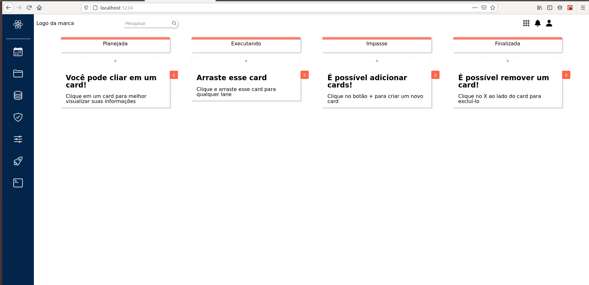

# Teste Frontend Bsine

A aplicação permite a criação, a exclusão e a visualização de cards e sua movimentação entre diferentes 'lanes'.

Cards novos não estão sendo mantidos, eles são perdidos após refresh da aplicação.

## Rodando localmente

Clone esse repositório.

Instale as dependências com `npm install`.

Utilize o comando `npm run dev`

O projeto ficará disponível em `http://localhost:1234/`

## Foi usado

**parcel**

**react-dnd**

**react-modal**

**sass**
